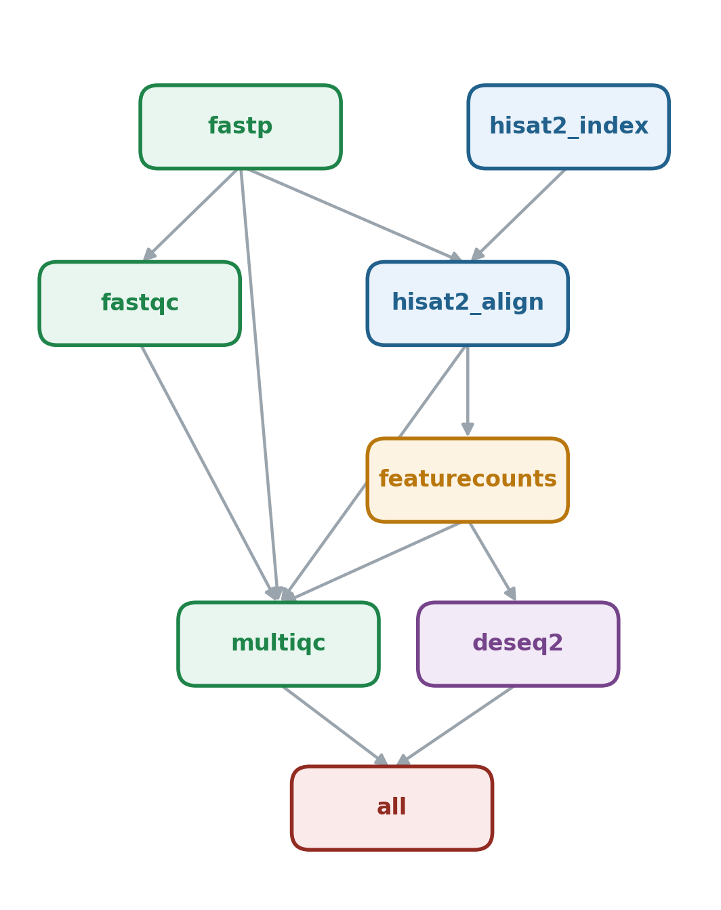

# RNA-seq → Differential Expression (Snakemake)

A general-purpose, reproducible RNA-seq workflow that takes **raw paired-end
FASTQ files** all the way to a ranked list of **differentially expressed genes
(DEGs)** with publication-style QC and diagnostic plots. Point it at your own
reads + reference, and run one command.

<p align="center">
  
</p>


*Rule dependency graph: each box is a step, each arrow a data dependency.*

---

## What it does and why (the logic)

RNA-seq differential expression always follows the same five questions, and
each rule in this pipeline answers one of them:

1. **Are the reads clean?** Sequencing adapters and low-quality tails bias
  everything downstream, so we trim and quality-filter first (**fastp**).
2. **Do I trust the data?** We profile each sample (**FastQC**) and collapse
  every tool's logs into a single report (**MultiQC**) so problems are
   obvious at a glance instead of buried across dozens of files.
3. **Where do the reads come from?** We map them to the genome with a
  splice-aware aligner (**HISAT2**), then sort + index the alignments
   (**samtools**) — streamed through a pipe so no giant SAM file ever hits disk.
4. **How much is each gene expressed?** We count reads per gene across *all*
  samples at once (**featureCounts**), producing one raw-count matrix.
5. **What actually changed between conditions?** We model the counts and test
  for differential expression (**DESeq2**), emitting a results table, the
   significant subset, and PCA / MA / volcano / sample-distance plots.

```
raw reads ──fastp──▶ trimmed ──HISAT2──▶ sorted BAM ──featureCounts──▶ counts ──DESeq2──▶ DEGs + plots
                       └─FastQC─┐                          │
                               └──────────── MultiQC ──────┘   (one QC report)
```

**Design choices worth knowing:**

- *Counts, not TPM, feed DESeq2.* DESeq2 models raw integer counts; normalising
to TPM first would throw away the information its statistics rely on.
- *One small conda env per tool* (`workflow/envs/`). With `--use-conda` Snakemake
builds them on demand, so a run is reproducible on any machine years later.
- *The genome index is built once* and reused by every sample.
- *Everything is config-driven* — you never edit workflow code to run your data.

---

## Requirements

- [Snakemake](https://snakemake.readthedocs.io) ≥ 7 (`pip install snakemake` or `conda install -c bioconda snakemake-minimal`)
- `conda` / `mamba` (for `--use-conda`; the bio tools install themselves)
- The per-tool software (fastp, HISAT2, samtools, subread, R/DESeq2) is
installed automatically into per-rule conda envs — you don't install it yourself.

---

## Quickstart (verify your setup on the built-in test data)

A tiny synthetic dataset ships in `.tests/integration/` (6 samples, 3 per
group). Use it to confirm everything works before touching real data:

```bash
# from the personal_pipeline/ directory

# 1) Dry run — builds the job plan, runs nothing. ALWAYS do this first.
bash .tests/run_integration_test.sh   # full end-to-end run on the test data
```

Or run the workflow manually against the test data:

```bash
cd .tests/integration
snakemake --snakefile ../../workflow/Snakefile --use-conda --cores 2
```

This exercises the complete pipeline (including the real DESeq2 statistics,
since the test data has replicates) in a couple of minutes.

---

## Run it on YOUR data (no code changes)

The entire interface is **two text files** in `config/`.

**Step 1 — list your samples in `config/samples.tsv`** (tab-separated, one row
per sample; add as many replicates as you have):

```
sample          condition   fq1                          fq2
control_rep1    control     data/ctrl1_R1.fastq.gz       data/ctrl1_R2.fastq.gz
control_rep2    control     data/ctrl2_R1.fastq.gz       data/ctrl2_R2.fastq.gz
control_rep3    control     data/ctrl3_R1.fastq.gz       data/ctrl3_R2.fastq.gz
treatment_rep1  treatment   data/treat1_R1.fastq.gz      data/treat1_R2.fastq.gz
treatment_rep2  treatment   data/treat2_R1.fastq.gz      data/treat2_R2.fastq.gz
treatment_rep3  treatment   data/treat3_R1.fastq.gz      data/treat3_R2.fastq.gz
```

- `sample` — a unique name (becomes the file-naming key throughout).
- `condition` — the group label DESeq2 compares.
- `fq1` / `fq2` — paths to the paired FASTQs, **relative to this directory**
(or absolute). Paired-end reads are required.

**Step 2 — set paths and parameters in `config/config.yaml`:**

- `reference.fasta` / `reference.gtf` → your genome FASTA and matching GTF.
- `featurecounts.strandedness` → `0` unstranded, `1` forward, `2` reverse
(a wrong value silently discards most reads — check your library prep).
- `deseq2.reference_level` / `treatment_level` → must match your `condition`
values; fold-changes are reported as *treatment vs reference*.
- `deseq2.padj_threshold` / `lfc_threshold` → significance cutoffs.

**Step 3 — run:**

```bash
# Always preview the plan first:
snakemake -n --cores 8

# Then execute (first run builds the conda envs):
snakemake --use-conda --cores 8
```

Results land in `results/`:

- `results/qc/multiqc_report.html` — the QC overview for the whole run.
- `results/counts/all_samples_counts.tsv` — the raw gene-count matrix.
- `results/deg/deseq2_results.tsv` — all genes (log2FC, p-value, padj).
- `results/deg/deseq2_significant.tsv` — genes passing your cutoffs.
- `results/deg/{pca,ma,volcano,sample_distance_heatmap}.pdf` — figures.

---

## Testing

```bash
# Fast unit/smoke test (no bio tools needed): parses the workflow and builds
# the DAG against the tiny test dataset. Catches broken rules in seconds.
pytest .tests/                # or: python .tests/test_dryrun.py

# Full end-to-end test (runs the real tools via conda; a few minutes):
bash .tests/run_integration_test.sh
```

`.tests/integration/generate_test_data.py` deterministically regenerates the
tiny genome + reads, so the test data never needs to be committed.

---

## Project layout

```
personal_pipeline/
├── config/
│   ├── config.yaml        # reference paths, strandedness, DESeq2 settings
│   └── samples.tsv        # your samples (the main file you edit)
├── workflow/
│   ├── Snakefile          # entry point: includes + final targets (rule all)
│   ├── rules/             # one .smk file per stage
│   │   ├── common.smk             # sample-sheet loader + helper functions
│   │   ├── trimming.smk           # fastp
│   │   ├── quality_control.smk    # FastQC + MultiQC
│   │   ├── alignment.smk          # HISAT2 index/align + samtools
│   │   ├── quantification.smk     # featureCounts
│   │   └── differential_gene_expression.smk  # DESeq2
│   ├── envs/              # per-rule conda environments
│   └── scripts/deseq2.R   # the differential-expression analysis
├── .tests/               # tiny dataset + unit/integration tests
├── images/               # workflow DAG figures
├── make_dag.sh           # regenerate the DAG figure (snakemake + graphviz)
└── README.md
```

---

## Useful commands & tips

```bash
snakemake -n --cores 1                          # dry run (the plan)
snakemake --use-conda --cores 8 -p              # real run, echo commands
snakemake --cores 1 results/aligned/<s>.sorted.bam   # build ONE target
snakemake --use-conda --conda-frontend mamba --cores 8 --conda-create-envs-only  # pre-build envs
bash make_dag.sh                                # regenerate images/dag.{png,pdf} (needs graphviz)
```

- **First run is slow**, then fast. Building the conda envs and the genome
index is a one-time cost; later runs reuse them and only recompute what
changed. Speed up env solves with `--conda-frontend mamba` (and
`conda config --set solver libmamba`).
- `**--cores` only helps where jobs are independent.** Early on, all samples
wait on the single genome-index job, so extra cores don't shorten that step.
- **Replicates matter.** With <2 samples per group DESeq2 cannot compute
statistics; the script falls back to *descriptive* fold-changes with no
p-values. Use **≥3 replicates per group** for real conclusions.
- **Always run from this directory** — config paths are resolved relative to it.

